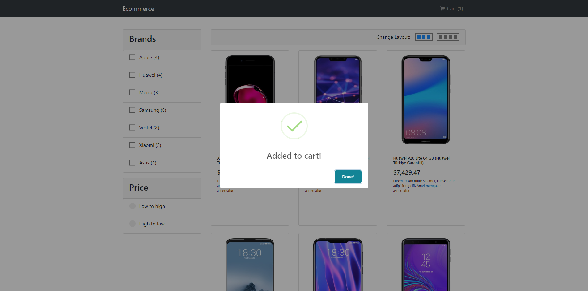

# Here is the live demo <a href="http://sincere-wind.surge.sh" style="font-size: 40px">CLICK TO SEE DEMO</a>





# ecomerce

## Project setup
```
yarn install
```

### Compiles and hot-reloads for development
```
yarn run serve
```

### Compiles and minifies for production
```
yarn run build
```

### Run your tests
```
yarn run test
```

### Lints and fixes files
```
yarn run lint
```

### Customize configuration
See [Configuration Reference](https://cli.vuejs.org/config/).
